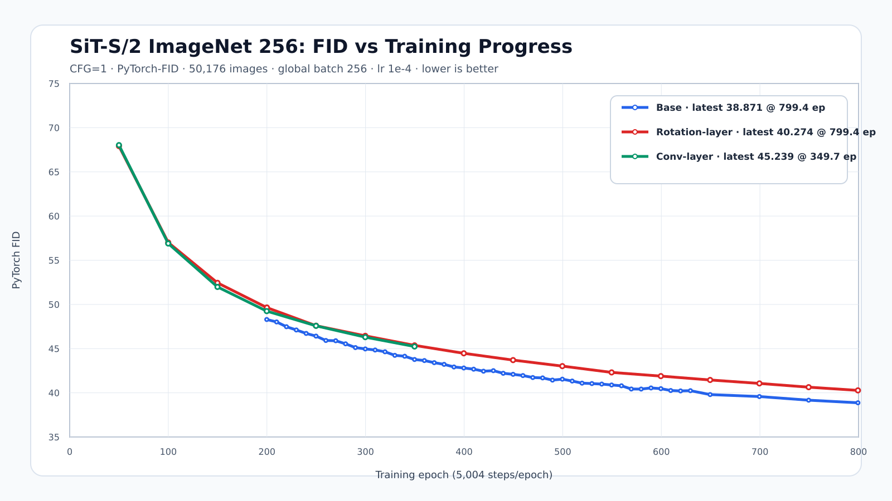

# SiT-Complementary 实验结果

本文整理 Hugging Face 仓库
[BlueSourceJY/SiT-Complementary](https://huggingface.co/BlueSourceJY/SiT-Complementary)
中备份的 SiT-S/2 自训练实验。当前备份包含 Base、Rotation-layer 和
Conv-layer 的 FID 记录，但**不包含 Inception Score（IS）记录**，因此下表将
IS 标为“未记录”，不使用推测值，也暂不加入官方 checkpoint 对比。

## 统一实验设置

三组实验使用 ImageNet-1K 256×256、全局 batch size 256、AdamW、学习率
`1e-4`、Linear/velocity transport 和 SD VAE EMA。每个 epoch 为 5,004 个
训练 step。

训练曲线使用 CFG=1、seed 0、250 步 Euler ODE 采样。每次测评请求生成
50,000 张图；由于 8 卡并行批大小对齐，实际生成并用于 PyTorch-FID 的样本数
为 **50,176**。参考统计量为
`SII-PengZheng/discon/VIRTUAL_imagenet256_labeled.npz`。FID 越低越好。

曲线的原始记录分别位于：

- [Base TSV](../experiments/bs256_lr1e-4/base/fid_cfg1_50k.tsv)
- [Rotation-layer TSV](../experiments/bs256_lr1e-4/rotation-layer/fid_cfg1_50k.tsv)
- [Conv-layer TSV](../experiments/bs256_lr1e-4/conv-layer/fid_cfg1_50k.tsv)
- [合并 CSV](../experiments/bs256_lr1e-4/fid_cfg1_50k_training_curves.csv)

## 训练进度概览

| 模型 | 备份 checkpoint | 实际进度 | 最新曲线测点 | CFG | FID | 测评样本数 |
| --- | --- | ---: | ---: | ---: | ---: | ---: |
| Base | `4003200.pt` | 800 epoch | 4,000,000 step（799.36 epoch） | 1 | 38.871 | 50,176 |
| Rotation-layer | `4003200.pt` | 800 epoch | 4,000,000 step（799.36 epoch） | 1 | 40.274 | 50,176 |
| Conv-layer | `1950000.pt` | 389.69 epoch | 1,750,000 step（349.72 epoch） | 1 | 45.239 | 50,176 |

Conv-layer 训练在下一个周期性 FID 测点之前停止。其最新 checkpoint 是
1,950,000 step，但最新完成的同协议 FID 测评对应 1,750,000 step；两者不能
混写为同一训练进度。

## 800 epoch 最终对比

目前只有 Base 和 Rotation-layer 完成 800 epoch。CFG=1 是 4,000,000 step
的最后一个周期测点；CFG=4 使用最终 4,003,200-step checkpoint。

| 模型 | checkpoint / 测点 | CFG | FID | IS | 测评样本数 |
| --- | --- | ---: | ---: | --- | ---: |
| Base（自训练） | 4,000,000-step 周期测点 | 1 | 38.871 | 未记录 | 50,176 |
| Rotation-layer（自训练） | 4,000,000-step 周期测点 | 1 | 40.274 | 未记录 | 50,176 |
| Base（自训练） | `4003200.pt` | 4 | 11.042 | 未记录 | 50,176 |
| Rotation-layer（自训练） | `4003200.pt` | 4 | 11.189 | 未记录 | 50,176 |

在现有同协议记录中，Base 在 CFG=1 和 CFG=4 下都略优于 Rotation-layer：
FID 分别低 1.403 和 0.147。由于没有重复运行或误差条，本文不据此判断差异的
统计显著性。

## Checkpoint 与可复现性

权重未提交到 Git，以避免把约 3.7 GB 的模型文件加入仓库。可从 Hugging Face
直接下载：

- [Base 4003200.pt](https://huggingface.co/BlueSourceJY/SiT-Complementary/blob/main/checkpoints/bs256_lr1e-4/base/4003200.pt)
- [Rotation-layer 4003200.pt](https://huggingface.co/BlueSourceJY/SiT-Complementary/blob/main/checkpoints/bs256_lr1e-4/rotation-layer/4003200.pt)
- [Conv-layer 1950000.pt](https://huggingface.co/BlueSourceJY/SiT-Complementary/blob/main/checkpoints/bs256_lr1e-4/conv-layer/1950000.pt)

[checkpoint_validation.json](../experiments/bs256_lr1e-4/validation/checkpoint_validation.json)
记录了文件大小、SHA-256、对应模型模块及严格加载/推理验证结果。新服务器部署、
数据准备、抽样验证和续训步骤见 [RESUME_GUIDE.md](RESUME_GUIDE.md)。
